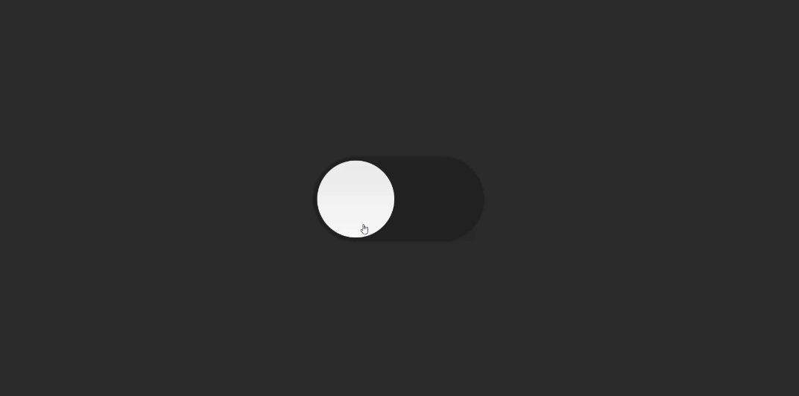

# Dark Mode

 
 
 - Trocando para o modo escuro em uma página

 - Projeto construído durante o curso PROPROFISSÃO.

## Acesso 👨🏻‍💻
 [Clique aqui para acessar! :)]()

## Tecnologias 👾
- HTML
- CSS
- JavaScript
- Git e Github

## Contato
[(LinkedIn)](https://www.linkedin.com/in/fellype-oliveira-920699230/)
-----
fellypeoliveira2020@gmail.com